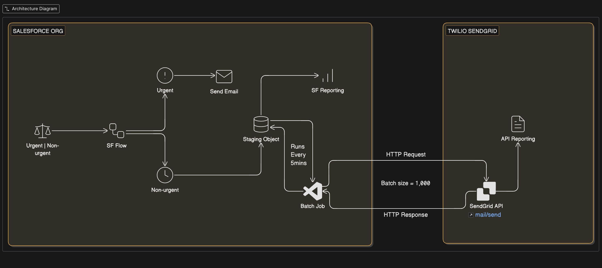

# 🚀 Enterprise Messaging Engine: 98% Cost Reduction
### Salesforce + Twilio SendGrid Decoupled Architecture

  

  

## 💰 The Business Impact (ROI)
**The Problem:** Salesforce enforces a strict Daily Single Email Message Limit (typically 5,000 per 24 hours). To bypass these limits natively, organizations are often forced to upgrade to enterprise tools like Marketing Cloud, which starts at approximately $15,000/year.
**The Solution:** This engine integrates with [SendGrid’s Transactional API](https://sendgrid.com/en-us/pricing) to provide high-volume delivery for as low as **$19.95/month** (Essentials Tier). By offloading bulk traffic, the organization secures unlimited volume for approximately **$240/year**.

**Annual Savings: $14,760+ per Org.**

---

## 🏗️ System Design: "The Post Office Model"
To avoid overwhelming Salesforce with high volume, I implemented a **Decoupled Messaging Pattern**.

### How it Works:
1. **The Sorter (Flow):** Logic separates "Urgent" vs "Bulk" mail. Bulk mail is queued in a **Staging Object** (The "Waiting Room").
2. **The Delivery Truck (Apex Batch):** A scheduled job runs every 5 minutes, picking up 1,000 records per "trip" to maximize API efficiency.
3. **The Handshake (Integration):** We use the **SendGrid v3 API** to deliver the mail and bring "Success/Failure" data back into Salesforce for reporting.

---

## 🛠️ Technical Highlights (For Architects)
* **Asynchronous Pattern:** Prevents "Apex CPU Limit" errors by offloading heavy work.
* **At-Least-Once Delivery:** Uses status tracking on staging records to ensure no message is lost.
* **Bulkification:** Aggregates 1,000 records into a single JSON payload to respect API rate limits.

## 🚀 Roadmap: Scaling to AWS
As volume grows, the next phase replaces the Apex Batch with **AWS EventBridge + Lambda**. This "Multi-Cloud" approach removes the processing load from Salesforce entirely, allowing for infinite scalability.

---

## 📂 Project Structure
| Component | Path | Responsibility |
| :--- | :--- | :--- |
| **The Engine** | [`/force-app/main/default/classes/SendGridDispatcherBatch.cls`](./force-app/main/default/classes/SendGridDispatcherBatch.cls) | Apex Batch job handling 1k-record bulkification and API handshaking. |
| **The Queue** | [`/force-app/main/default/objects/Outbound_Message_Queue__c`](./force-app/main/default/objects/Outbound_Message_Queue__c) | Custom Staging Object acting as the persistent messaging buffer. |
| **The Router** | [`/force-app/main/default/flows/Email_Router.flow`](./force-app/main/default/flows/Email_Router.flow) | Low-code logic engine for priority-based message sorting. |
| **Service Layer** | [`/force-app/main/default/classes/SendGridService.cls`](./force-app/main/default/classes/SendGridService.cls) | Orchestrates HTTP Callouts and manages API authentication. |